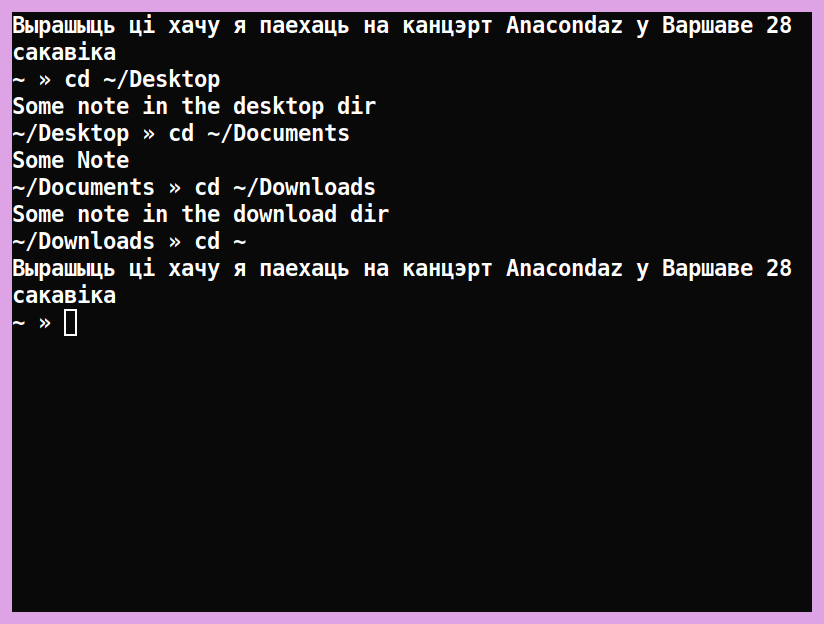

# ShellAutoCat



This script adds to your .\*shrc the auto output of the file you need (if it exists in the directory) when starting your \*sh and when changing the directory.

## Installation:

In order to add this script to your .\*shrc, clone this repository for yourself:
```
git clone https://github.com/grndot/ShellAutoCat.git
```
change directory to:
```
cd ShellAutoCat
```

make the ``install.sh`` executable:
```
chmod +x install.sh
```
then run it: 
```
./install.sh
```
fill in all the fields that the installer asks.

For updating your current shell config use ```source ~/.*rc``` command, where * is name of your current shell (sh, bash, zsh and etc.).


## Uninstallation:

For uninstalling this script from **ALL** your shell configs, make executable ```uninstall.sh``` by commnad ```chmod +x uninstall.sh``` and execute it using command ```./uninstall.sh```.
